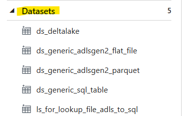

# Accelerated Healthcare Revenue Management Insights Project

## Project Overview

**Objective:** Establish a robust data engineering pipeline that leverages data quality checks to deliver timely, accurate, and reliable data-driven insights for healthcare revenue cycle management (RCM). This pipeline will generate fact and dimension tables to support reporting teams in generating critical KPIs.

## Problem Statement:

Healthcare providers face challenges in managing their revenue cycle. Inefficient processes, data quality issues, and a lack of insights can lead to delayed payments, increased costs, and reduced operational efficiency.

## Domain Knowledge: Healthcare Revenue Cycle Management (RCM)

RCM is a complex process with multiple stages, including:

*   **Patient Visit:** Patient information and insurance details are collected.
*   **Service Delivery:** Healthcare services are provided by doctors and hospitals.
*   **Billing:** Bills are generated and sent to insurance providers or patients.
*   **Claims Processing:** Insurance companies review claims and make payment decisions.
*   **Payment and Follow-up:** Payments are collected and follow-up actions are taken for outstanding balances.
*   **Performance Tracking:** Key performance indicators (KPIs) are monitored for improvement areas.

RCM ensures the hospital can provide quality care while maintaining financial health.

*   **Accounts Receivable (AR):** Money the hospital must collect from patients and insurance companies for services rendered.
*   **Accounts Payable (AP):** Money the hospital owes to stakeholders like doctors, staff, and suppliers.

**Key Risk Factors and Challenges:**

*   **Patient Responsibility:** A significant risk arises when patients are responsible for a portion or the entire cost of their care.

**Objectives for Accounts Receivable:**

*   **Maximize Patient Payments:** Encourage timely and complete payments from patients.
*   **Minimize Collection Period:** Reduce the time it takes to collect outstanding balances.

## Project Data Architecture and Execution Flow

The project employs a Medallion architecture for data flow:
**Project Flow:**

`Landing (flat file) -> Bronze (Parquet files) -> Silver (Delta table) -> Gold (Delta table)`

**Data Sources:**

*   Electronic Medical Records (EMR) Data (Azure SQL Database)
*   Claims Data (Flat files uploaded monthly provided by insurance companies to ADLS Gen2)
*   NPI Data (Sourced from a public API)
*   ICD Codes (Sourced from a public API)
*   CPT Codes (Flat files uploaded monthly to ADLS Gen2)

**Key Components:**

*   **Data Ingestion:** Azure Data Factory (ADF) for data ingestion from various sources.

*   **Data Transformation:** Data cleaning, validation, normalization, and enrichment using Azure Databricks.
*   **Data Storage:** Azure Data Lake Storage Gen2 for storing raw and processed data.
*   **Data Warehouse:** Delta Lake tables for storing the refined data.
*   **Data Quality Monitoring:** Regular checks to ensure data accuracy and completeness.
*   **Data Security:** Using Key Vault for storing passwords and all credential keys.

## Data Model

**Fact Table:** `fact_transactions` (This table stores the core transactional data related to healthcare services provided. It captures the events that generate revenue and are the primary focus of RCM analysis. Each row in this table represents a single transaction (e.g., a specific medical procedure performed on a patient).)

**Dimension Tables:**

*   `dim_patient` (Stores information about patients.)
*   `dim_provider` (Stores information about healthcare providers (doctors, nurses, etc.).)
*   `dim_department` (Stores information about hospital departments (e.g., Cardiology, Oncology).)
*   `dim_icd_code` (Stores information about ICD codes (International Classification of Diseases))
*   `dim_npi` (NPI data)
*   `dim_cpt_code` (Stores information about CPT codes (Current Procedural Terminology))

## Key Data Modeling Strategies

*   **Common Data Model (CDM):** Standardization ensures alignment with industry standards and best practices. Mapping rules reconcile schema and data elements between hospitals.
*   **Data Quality Checks:** Data cleansing techniques remove or correct errors, inconsistencies, and outliers. Validation checks ensure data accuracy and completeness. Consistency across sources and transformations is verified.
*   **Slowly Changing Dimensions (SCD2):** Captures changes in dimension tables over time. Historical data is maintained for trend analysis and reporting. Effective date and end date columns track changes and validity periods.

## Project Implementation Steps

### Background Activity - Preprocessing: Loading EMR Data into SQL Databases

Before proceeding with the main data pipeline, a preliminary step involves loading the EMR data from CSV files into Azure SQL Database tables for both hospitals (Hospital A and Hospital B). This ensures the SQL databases are populated with the necessary data for subsequent pipeline stages. This is achieved through an Azure Data Factory (ADF) pipeline named `pipe_to_insert_data_to_sql_table_preprocessing`.

**Data Sources:**

*   CSV files representing EMR data for each hospital. These files are uploaded to a dedicated container (`raw-data-for-sql-database`) within the provided ADLS Gen2 storage (`adlshealthcareprojectdev`). The files are organized within folders `HospitalA` and `HospitalB` for clarity.

*   A lookup file (JSON format) is also uploaded to the same container within a folder called `Lookup`. This file is used for metadata or configuration during the data loading process.

**Data Sinks:**

*   Azure SQL Databases: `sqldb-hospital-a` and `sqldb-hospital-b`. These databases are assumed to be pre-existing.

**Pipeline Creation Steps:**

1.  **Creation of Linked Services:**

    *   **For ADLS Gen2 (Source):** The linked service `ls_adlsgen2` is used.
    *   **For SQL DB (Sink):** The existing linked service `ls_azuresqldb` is used.
2.  **Creation of Datasets:**

    *   **For Source (CSV files):** The generic dataset `ds_generic_adlsgen2_flat_file` is used.
    *   **For Sink (SQL tables):** The generic dataset `ds_generic_sql_table` is used.
    *   **For Lookup File:** A new dataset is created `ds_for_lookup_file_adls_to_sql`, specifying ADLS Gen2 as the source and JSON as the file format.

**Pipeline Configuration Steps:**

1.  **Add a Lookup Activity:** This activity reads the lookup file (JSON). The "First row only" option is set to `false` to read all rows.
2.  **Add a ForEach Activity:** This activity iterates over the output of the Lookup activity. The `Items` property is set to `@activity('Lk_file_name').output.value`.

3.  **Configure the ForEach Activity:** Inside the ForEach activity:
    *   **Add a Copy Data Activity:** This activity copies data from the CSV files to the SQL tables.
        *   **Source:** Uses the source dataset (`generic_adls_flat_file_ds`).

        *   **Sink:** Uses the destination dataset (`ds_generic_sql_table`).

**Data Loading Logic:** The pipeline copies data from the CSV files into the following tables within the respective SQL databases:

*   Departments
*   Providers
*   Encounters
*   Patients
*   Transactions

**Outcome:** Upon successful execution of the pipeline, the SQL databases are populated with the EMR data from the CSV files, making the data available for the subsequent stages of the main data pipeline.

### 0. Environment Setup

**Securing the Pipeline with Key Vault and Mount Points:** This section details how Key Vault and mount points are used to optimize data pipeline security and organization.

*   **0.1 Securing the Pipeline with Key Vault and Mount Points:** Mount points (landing, bronze, silver, gold, configs) improve data organization, enhance security by storing sensitive information in Azure Key Vault, simplify configuration, and enable flexible scaling.
*   **0.2 Key Vault Setup:**

    *   Create Key Vault (e.g., `tt-health-care-kv`).
    *   Add Secrets:
        *   `sql-db-pwd` (SQL Database access key)
        *   `tt-adls-access-key-dev` (ADLS Gen2 access key)
        *   `tt-hc-abd-ws-pat` (Databricks workspace access token)
    *   Create Databricks Secret Scope (e.g., `tt-hc-kv`) linked to the Key Vault.
    *   Implement Granular Access Control (Permissions) by registering applications in Azure AD and assigning specific Key Vault permissions.
*   **0.3 Mounting Storage with Secure Access:** (Code snippet to be included in the project repository). This section would contain code for mounting storage using `dbutils.fs.mount`.

### Step 1: Data Ingestion - Create ADF pipeline

*   **1.1 ADF pipeline for ingesting EMR data from Azure SQL to Bronze:**

    *   Uses parameterized queries and metadata-driven configuration (load patterns stored in `ttadlsdev` in ADLS Gen 2 `emr/load_config.csv`).

    *   Loads tables based on the `load_config` file and inserts load activity results into an `audit.load_logs` Delta table.
    *   Uses Linked Services for connections to:

        *   Azure SQL DB (parameterized for both hospitals)
        *   ADLS Gen2
        *   Delta Lake (for audit table)
        *   Key Vault
        *   Databricks
    *   Uses Datasets with parameters for database name, schema name, table name, config file path, target data path, and audit table details.
  
    *   Pipeline Activities:
        1.  **Lookup Activity:** Reads the config file (`configs/emr/load_config.csv`).
        2.  **For Each Activity:** Iterates over each entity in the config file.
            *   Runs pipelines for ingesting tables in parallel.
            *   **Get Metadata Activity:** Checks if the file exists in the Bronze folder.
            *   **If Condition (File Exists):** Moves existing files to an archive folder.
            *   **If Condition (is_active Flag):** Checks the `is_active` flag in the config file. Executes pipeline for data loading if `is_active` is 1.
   
                *   **If Condition (Load Type - Full):** Performs a full load using a Copy Data activity and inserts logs into the audit table.
                *   **If Condition (Load Type - Incremental):** Performs an incremental load by fetching the last loaded date from the audit table, copying new data, and inserting new logs.
*   **1.2 Ingesting Claim and CPT code data from Landing to Bronze:**
    *   Uses Databricks notebooks to ingest data from the landing folder (`/claims` and `/cptcodes`) to the bronze folder in Parquet format with overwrite mode.
    *   Performs minor transformations (column name modifications, data source input).
    *   Creates temporary views for data quality checks.
*   **1.3 Ingesting NPI and ICD data from public API to Bronze:** (Code snippet to be included in the project repository).
    *   Extracts data from public APIs.
    *   Defines schemas for each column.
    *   Creates DataFrames with defined schemas and writes them in Parquet format (append mode for ICD, overwrite mode for NPI).
*   Implements retries in ADF pipeline activities.
*   Implements Unity Catalog for data sharing across workspaces, creating a catalog named `tt_hc_adb_ws` with a schema/database `audit` and table `load_logs`.

### Step 2: Data Transformation - Implement the Silver Layer

**Data in Bronze Layer:**

*   EMR data (Providers, Departments, Patients, Transactions, Encounters)
*   Claims data
*   CPT data
*   NPI data
*   ICD codes

**Transformation Logic:**

*   **Providers:** Full load, overwrite using Delta tables without SCD. Unions data from both hospitals, creates a schema with an `is_quarantined` column for data quality checks, performs data quality checks for null values and duplicate Provider IDs.
*   **Departments:** Full load, overwrite using Delta tables without SCD. Unions data from both hospitals with transformations for mismatched department IDs, creates a schema with `is_quarantined`, performs data quality checks for null values.
*   **Patients:** SCD2 and incremental load using Delta tables. Unions data from both hospitals with schema adjustments, performs data quality checks for null values, loads data into the Silver layer, and implements SCD2 using `MERGE INTO` with `inserted_date`, `modified_date`, and `is_current` columns.
*   **Transactions:** Implementing SCD2 and incremental load using Delta table format. (Details to be provided.)
*   **Encounters:** Implementing SCD2 and incremental load using Delta table format. (Details to be provided.)
*   **Claims & CPT:** Implementing SCD2 and incremental load using Delta table format. (Details to be provided.)
*   **NPI & ICD codes:** Implementing SCD2 and incremental load using Delta table format. (Details to be provided.)

### Step 3: Data Loading - Implement the Gold Layer

Data in the Gold layer consists of the latest, non-quarantined records (`is_quarantined = False`).

**Facts and Dimensions:**

*   **`dim_patient`:** (Details of transformations and aggregations to be provided.)
*   **`dim_cpt`:** (Details of transformations and aggregations to be provided.)
*   **`dim_department`:** (Details of transformations and aggregations to be provided.)
*   **`fact_transactions`:** (Details of transformations and aggregations to be provided.)

## Further Enhancements (Future Considerations)

*   Implement more comprehensive data quality rules and monitoring.
*   Implement data lineage tracking.
*   Enhance CI/CD pipeline with automated testing and deployment.
*   Implement more sophisticated performance tuning and optimization strategies.  

![]
![]
![]
![]
![]
![]
![]
![]

